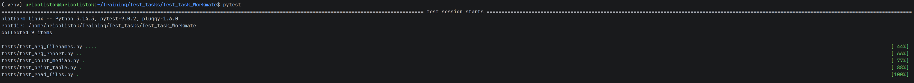
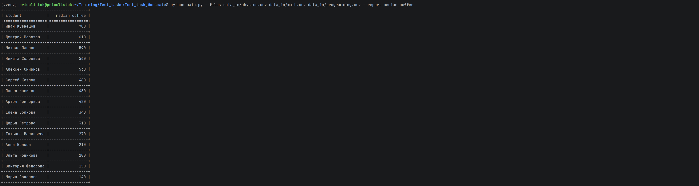
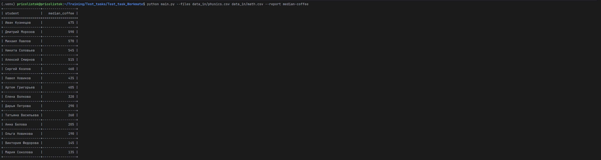
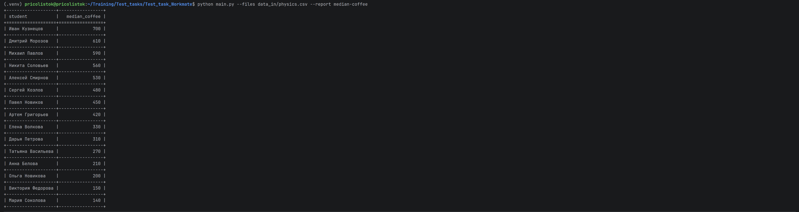
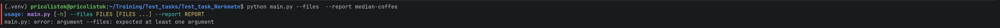
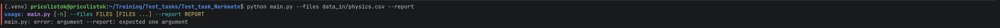

# Coffee Statistics CLI

# Общее описание

В программе реализована возможность удобного добавления новых отчётов.
Все отчёты наследуются от базового класса `Report`, в котором определён единый интерфейс через абстрактные методы.

Для создания отчётов используется словарь, где ключом является тип отчёта, а значением — соответствующий класс.

Благодаря такой реализации новый отчёт можно добавить:

* реализовав новый класс, наследующийся от `Report`;
* добавив его в словарь доступных отчётов.

---

# Примеры запуска

# Тесты

## Описание тестов

### Тестирование обработки аргументов, отвечающих за передачу файлов

* `test_path_positive` — позитивный тест, когда все аргументы переданы корректно, и программа должна выполниться без ошибок
* `test_path_with_error_in_one_arg_negative` — негативный тест, когда имя одного из файлов передано неверно
* `test_path_with_error_in_more_arg_negative` — негативный тест, когда имена нескольких файлов переданы неверно
* `test_zero_files_args` — негативный тест, когда не передан ни один файл

### Тестирование обработки аргументов, отвечающих за передачу типа отчёта

* `test_report_type_with_error_negative` — негативный тест, когда тип отчёта передан с ошибкой
* `test_empty_report_type_negative` — негативный тест, когда тип отчёта не передан

### Тестирование чтения данных из файла

* `test_read_stat_from_file_positive` — позитивный тест, проверяющий чтение данных из файла

### Тестирование подсчёта медианы

* `test_median_calculation_positive` — позитивный тест, проверяющий корректность расчёта медианы

### Тестирование вывода отчета

* `test_print_stats_positive` — позитивный тест, проверяющий корректность вывода отчета

